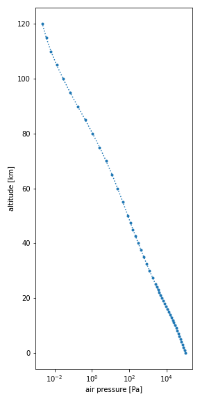
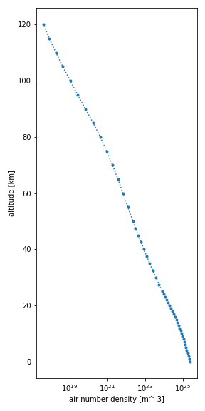

# How-to guides

## Quickstart

Make an atmospheric profile using *Joseki*'s 
[make](reference.md#src.joseki.core.make) method.
Use its `identifier` parameter to specify the atmospheric profile.
 
!!! example "Example"

    Make the *AFGL (1986) US Standard* profile with:

    ```python
    import joseki

    ds = joseki.make(identifier="afgl_1986-us_standard")
    ```


Display the available identifiers with:

```python
from joseki.profiles import factory

list(factory.registry.keys())
```

Use the [`to_dataset`](https://docs.xarray.dev/en/stable/generated/xarray.Dataset.to_netcdf.html)
method to save the dataset to the disk as a NetCDF file:

```python
ds.to_netcdf("my_data_set.nc")
```

Open the dataset again using 
[`xarray.open_dataset`](https://docs.xarray.dev/en/stable/generated/xarray.open_dataset.html):

```python
import xarray as xr

ds = xr.open_dataset("my_data_set.nc")
```

The datasets format is described [here](explanation.md#data-set-format).

## Cells representation

To make an atmospheric profile where data variables are given in altitude cells
instead of at altitude levels, set the parameter `represent_in_cells` to
`True`:

```python
ds = joseki.make(
    identifier="afgl_1986-us_standard",
    represent_in_cells=True,
)
```

The resulting dataset has a coordinate variable `z` that corresponds to
the altitude cells center and a data variable `z_bounds` that indicate the
altitude bounds of each altitude cell, i.e. atmospheric layer.

## Advanced options

The collection of atmospheric profiles defined by
`Anderson1986AtmosphericConstituentProfiles` includes volume mixing
ratio data for 28 molecules, where molecules 8-28 are described as *additional*.
By default, these additional molecules are included in the atmospheric profile.
To discard these additional molecules, set the `additional_molecules`
parameter to `False`:

```python
ds = joseki.make(
    identifier="afgl_1986-us_standard",
    represent_in_cells=True,
    additional_molecules=False,
)
```

The resulting dataset now includes only 7 molecules, instead of 28.

## Derived quantities

You can compute various derived quantities from a thermophysical properties
dataset produced by `joseki`, as illustrated by the examples below.

??? example "Column number density"

    ```python
    ds = joseki.make(identifier="afgl_1986-us_standard")
    ds.joseki.column_number_density["O3"].to("dobson_unit")
    ```
  
??? example "Column mass density"

    ```python
    ds.joseki.column_mass_density["H2O"]
    ```

??? example "Number density at sea level"

    ```python
    ds.joseki.number_density_at_sea_level["CO2"]
    ``` 

??? example "Mass density at sea level"

    ```python
    ds.joseki.mass_density_at_sea_level["CH4"]
    ```

For further details on these methods, refer to the [API reference](reference.md).

### Rescaling

You can modify the amount of a given set of molecules in your thermophysical
properties dataset by applying a 
[rescale](reference.md#src.joseki.accessor.JosekiAccessor.rescale) 
transformation.

!!! example "Example"

    ```python
    ds = joseki.make(identifier="afgl_1986-us_standard")
    rescaled = ds.joseki.rescale(
       factors={
          "H2O": 0.5,
          "CO2": 1.5,
          "CH4": 1.1,
       }
    )
    ```

In the example above, the amount of water vapor is halfed whereas the amount of
carbon dioxide and methane is increased by 150% and 110%, respectively.
When a rescale transformation has been applied to a dataset, its ``history`` 
attribute is updated to indicate what scaling factors were applied to what 
molecules.


### Plotting

!!! note "Note"

    For plotting, you will need to install the
    [matplotlib library](https://matplotlib.org).

You can easily make a plot of any of the variables of a dataset, i.e.,
air pressure (``p``), air temperature (``t``), air number density (``n``) or
volume fraction (``x_*``):

??? example "Pressure plot"

    ``` python
    import matplotlib.pyplot as plt 

    ds = joseki.make(
       identifier="afgl_1986-us_standard",
       additional_molecules=False
    )

    ds.p.plot(
       figsize=(4, 8),
       ls="dotted",
       marker=".",
       y="z",
       xscale="log",
    )
    plt.show()
    ```

    

??? example "Temperature plot"

    ```python
    ds.t.plot(
       figsize=(4, 8),
       ls="dotted",
       marker=".",
       y="z",
       xscale="linear",
    )
    plt.show()
    ```

    

??? example "Number density plot"

    ```python
    ds.n.plot(
       figsize=(4, 8),
       ls="dotted",
       marker=".",
       y="z",
       xscale="log",
    )
    plt.show()
    ```

    


??? example "Volume fraction plot"

    ```python
    plt.figure(figsize=(8, 8)) 

    for m in ds.joseki.molecules:
       ds[f"x_{m}"].plot(
          ls="dotted",
          marker=".",
          y="z",
          xscale="log",
       )

    plt.xlabel("volume fraction [dimensionless]")
    plt.legend(ds.joseki.molecules)
    plt.show()
    ```

    
